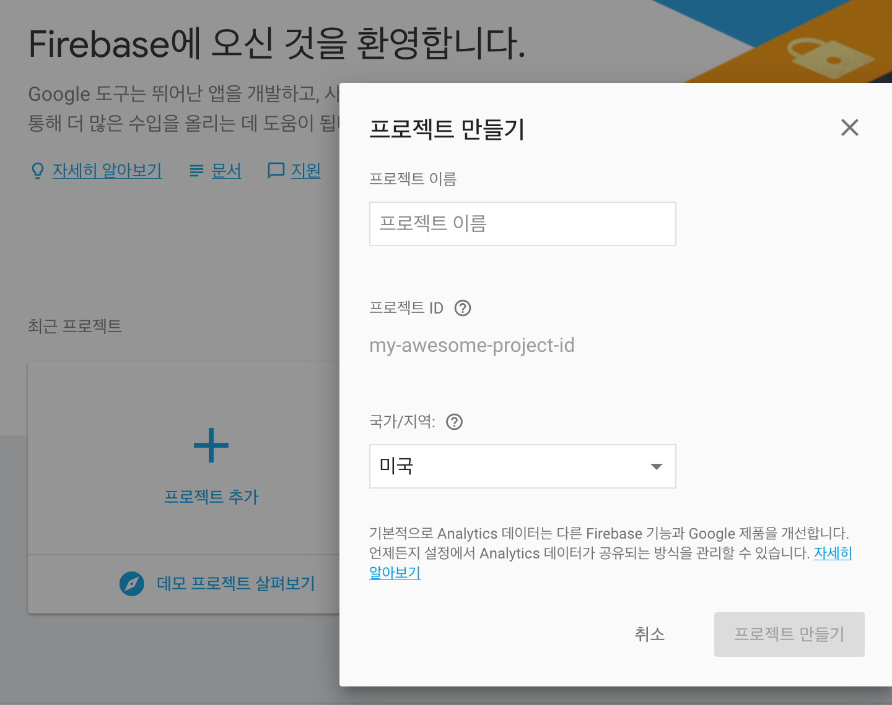

# Firebase guide

mac 기준으로 작성함.
구글에서 제공하는 공식 개발 문서는 [여기](https://firebase.google.com/docs/?hl=ko)에서 확인 가능하다.

## Firebase 개발을 위한 로컬 환경 설정

구글에서 제공하는 [ `Firebase CLI 참조 `](https://firebase.google.com/docs/cli/?hl=ko)문서를 참조.
npm 을 이용하여 Firebase cli를 설치한다.

### 1. node.js설치
[여기](https://nodejs.org/en/download/)에서 node.js를 다운받고 설치

### 2. Firebase cli 설치
node.js 를 설치하며 함께 설치된 `npm`을 이용해서 `firebase-tools` 를 전역 설치한다.
터미널을 열어 설치 작업을 진행하자.
```shell
sudo npm install firebase-tools -g
```

잘 설치되었는지 버전 확인 명령을 이용해서 확인해본다.
```shell
firebase --version
```

### 3. firebase cli login
이제 cli가 준비되었습니다. Firebase 를 사용하기 위해서 로그인.

```shell
firebase login
```

로그인을 진행하면 Firebase에서의 정보 수집을 허용할 것인지 묻습니다. Y 를 입력해 허용한다.
```shell
Yourui-MacBook-Pro:firebase your_name$ firebase login
? Allow Firebase to collect anonymous CLI usage and error reporting information? (Y/n)
```

제대로 로그인 하면 Terminal 에는 다음과 같은 메시지가 출력된다.
```shell
✔  Success! Logged in as your_id@gmail.com
```

### 4. Firebase console 에서 새 프로젝트 생성
[Firebase console](https://console.firebase.google.com/)에 접속하여 `프로젝트 추가`를 진행한다.



### 5. 프로젝트 설정
터미널을 통해 작업을 시작할 디렉토리로 이동한다.

```
firebase use --add
```

원하는 프로젝트를 선택한 뒤 엔터.
이제 프로젝트를 시작할 준비가 되었다.

#### 6. 내장 서버 사용
Firebase는 테스트를 위한 내장 서버를 지원한다. Firebase프로젝트를 준비한 디렉토리에서 다음 커멘드를 입력하면 서버가 시작된다.
```
firebase serve
```
커멘드에 다음과 같은 메시지가 표시될 것이다.

```shell
Listening at http://localhost:5000
```

`http://localhost:5000`로 접속하면 작업중인 폴더의 `index.html`파일을 내장 서버에서 실행한다.

이제 Firebase로 웹 개발을 할 준비가 끝났다.
