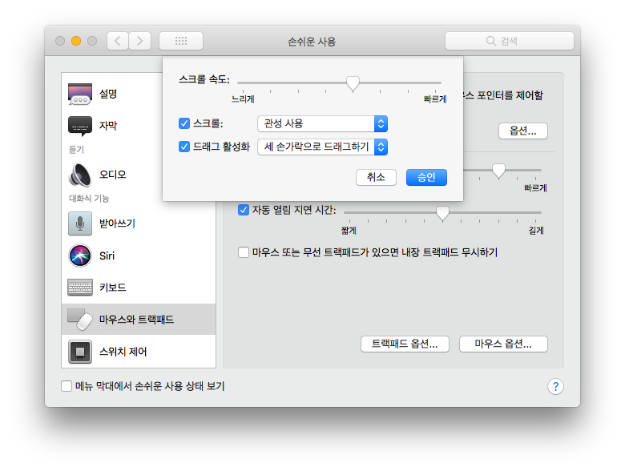

# Mac/system_settings.md

맥북 기본 시스템 설정

## System Preferences

### 1. 접근
- 상단 메뉴의  로고 -> 시스템 환경설정... (System Preferences...)
- Mission Control -> 시스템 환경설정 (System Preferences)
- Finder -> 응용 프로그램 -> 시스템 환경설정.app (System Preferences.app)
- Spotlignt(혹은 Alfred) -> 시스템 환경설정.app (System Preferences.app)

등등..

### 2. 설정

#### 언어 및 지역

- `선호하는 언어`에서 한국어를 기본 언어로 사용하면 간혹 local 설정 때문에 오류가 날 수 있다고 하는데 아직 겪지 못해 한국어로 사용중.

    특정 어플리케이션은 영어로 쓰는게 편한데(번역이 엉망이라거나..), 그 때는 [`Language Switcher`](http://www.tj-hd.co.uk/en-gb/languageswitcher/)를 써서 영어로 바꿔서 쓰고 있다.

    해당 앱의 소개는 Back to the mac 블로그의 [`[추천 무료앱] 맥용 소프트웨어를 사용자가 원하는 언어로 실행해 주는 유틸리티 두 가지. Language Swticher, App Language Chooser`](http://macnews.tistory.com/1358)에서 확인 가능.

- `시간 포멧`은 `24시간제`에 체크해서 사용중

#### 보안 및 개인정보 보호

촤측 하단의 자물쇠를 클릭하고, 계정 password를 입력하면 변경 가능상태가 된다. `암호 요구` 시간을 짧게 하면 보안상 더 안전하겠다. `화면이 잠겨있는 동안 메시지 표시`에서 잠금 메시지를 설정할 수 있다. 나는 분실상황을 대비하여 연락처를 써놓았다.

FileVault, 방화벽 등도 사용합시다.

#### 키보드 > 텍스트

텍스트 자동 변경 옵션을 모두 끈다. 개발할 때 거슬리기만 한다.

#### 키보드 > 단축키
- Spotlignt > Spotlignt 검색 보기 : ⌃ + Space

`Alfred`를 사용중인데, ⌥ + Space 를 `Alfred`에 항당해서 사용중이라서 `Spotlignt`의 단축키를 변경해주었다.

- 앱 단축키

앱 단축키에서는 각 응용프로그램에 대한 단축키를 임의로 할당할 수 있다. 편리할대로 이것저것 사용하는 중.

- 맥북프로 터치바 관련

맥북프로 터치바에서 옵션키를 기본으로 사용할 프로그램들을 지정할 수 있다.

#### 트랙패드
모든 옵션에 체크. 특히 클릭은 터치로 바꾸어 손의 피로를 줄인다.

3손가락 드래그 옵션은 `트랙패드` 메뉴에서 바꿀 수 없고, `시스템 환경 설정`>`손 쉬운 사용`>`마우스와 트랙패드`>`트랙패드 옵션...`>`드래그 활성화` 체크 후 `세 손가락으로 드래그하기` 옵션을 선택해줘야 한다.

#### 에너지 절약

잠자기 모드가 되는게 귀찮아서 이렇게 사용중..

####
